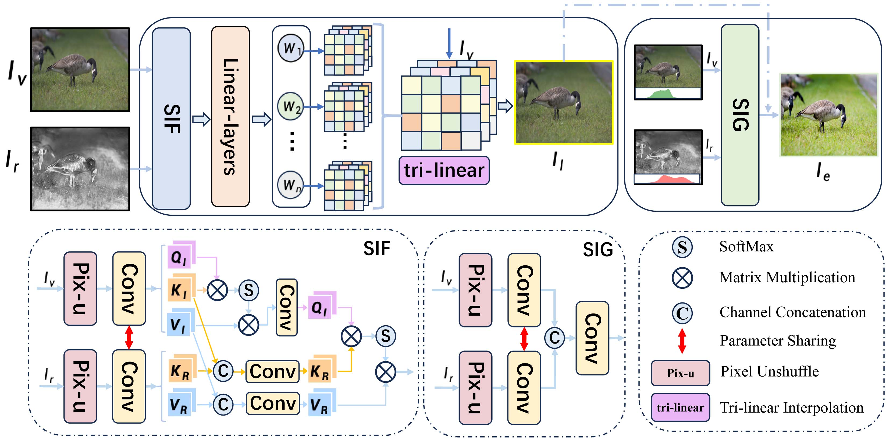

# SIRLUT
SIRLUT: Simulated Infrared Fusion Guided Image-adaptive 3D Lookup Tables for Lightweight Image Enhancement


Kaijiang Li, Hao Li, Haining Li,Peisen Wang, Chunyi Guo$^*$, Wenfeng Jiang

# Introduction

Due to the impact of the photographic environment and camera settings, images captured by cameras often require subsequent beautification processing. Recently, researchers have applied 3D Lookup Tables (LUTs) in cameras, offering new possibilities for enhancing image quality and achieving various tonal effects. However, this approach often overlooks the non-uniformity of color distribution in the original images, which limits the performance of learnable LUTs. To address this issue, we introduce a lightweight end-to-end image enhancement method called  Simulated Infrared Fusion Guided Image-adaptive 3D Lookup Tables (SIRLUT). On the one hand, SIRLUT enhances the adaptability of 3D LUTs by reorganizing the color distribution of images through the integration of simulated infrared imagery. On the other hand, SIRLUT consists of an efficient Simulated Infrared Fusion (SIF) module and a Simulated Infrared Guided (SIG) refinement module. The SIF module leverages a cross-modal channel attention mechanism to perceive global information and generate dynamic 3D LUTs, while the SIG refinement module blends simulated infrared images to match image consistency features from both structural and color aspects, achieving local feature fusion. By combining global adjustments through 3D LUTs with local perception via refinement modules, SIRLUT efficiently enhances images. Experimental results demonstrate that SIRLUT outperforms state-of-the-art methods on different tasks by up to 0.88 $\sim$ 2.25dB while reducing the number of parameters.


# Framework


## Usage


### Build
By default,

    cd trilinear_cpp
    sh setup.sh
### Requirements
Python3
```
conda env remove --name ir3dlut
conda create -n ir3dlut python==3.7
conda activate ir3dlut

pip install torch==1.8.1+cu111 torchvision==0.9.1+cu111 -f https://download.pytorch.org/whl/torch_stable.html


pip install tqdm
pip install scikit-image tqdm opencv-python omegaconf einops
pip install  transformers kornia==0.6.0 torch-summary==1.4.4
```


## Code Structure

- `bert-base-uncased/`: bert pretrained_model.
- `option/`: including configurations to conduct experiments.
- `data/`: dataset path.
- `dataset.py`: the dataset class for image enhancement (FiveK and PPR10K).
- `model.py`: the implementation of TITFormer model.
- `trainppr.py`: a python script to run a train PPR10K.
- `trainrgb.py`: a python script to run a train FiveK.

## Datasets

The paper use the [FiveK](https://data.csail.mit.edu/graphics/fivek/) and [PPR10K](https://github.com/csjliang/PPR10K) datasets for experiments. It is recommended to refer to the dataset creators first using the above two urls.

### Download

- FiveK

You can download the original FiveK dataset from the dataset [homepage](https://data.csail.mit.edu/graphics/fivek/) and then preprocess the dataset using Adobe Lightroom following the instructions in [Prepare_FiveK.md](Prepare_FiveK.md).

For fast setting up, you can also download only the 480p dataset preprocessed by Zeng ([[GoogleDrive](https://drive.google.com/drive/folders/1Y1Rv3uGiJkP6CIrNTSKxPn1p-WFAc48a?usp=sharing)],[[onedrive](https://connectpolyu-my.sharepoint.com/:f:/g/personal/16901447r_connect_polyu_hk/EqNGuQUKZe9Cv3fPG08OmGEBbHMUXey2aU03E21dFZwJyg?e=QNCMMZ)],[[baiduyun](https://pan.baidu.com/s/1CsQRFsEPZCSjkT3Z1X_B1w):5fyk]), including 8-bit sRGB, 16-bit XYZ input images and 8-bit sRGB groundtruth images.

After downloading the dataset, please unzip the images into the `./data/FiveK` directory. Please also place the annotation files in `./seplut/annfiles/FiveK` to the same directory. The final directory structure is as follows.

```
./data/fiveK
    input/
        JPG/480p/                # 8-bit sRGB inputs
        PNG/480p_16bits_XYZ_WB/  # 16-bit XYZ inputs
    expertC/JPG/480p/            # 8-bit sRGB groundtruths
    Infrared/PNG/480p/           # simulating infrared input
    train.txt
    test.txt
```

- PPR10K

We download the 360p dataset (`train_val_images_tif_360p` and `masks_360p`) from [PPR10K](https://github.com/csjliang/PPR10K) to conduct our experiments.

After downloading the dataset, please unzip the images into the `./data/PPR10K` directory. Please also place the annotation files in `./seplut/annfiles/PPR10K` to the same directory. The expected directory structure is as follows.

```
data/PPR10K
    source/       # 16-bit sRGB inputs
    source_aug_6/ # 16-bit sRGB inputs with 5 versions of augmented
    masks/        # human-region masks
    target_a/     # 8-bit sRGB groundtruths retouched by expert a
    target_b/     # 8-bit sRGB groundtruths retouched by expert b
    target_c/     # 8-bit sRGB groundtruths retouched by expert c
    Infrared      # 8-big simulating infrared input
    train.txt
    train_aug.txt
    test.txt
```
### expend data
Download link for simulating infrared image
| Dataset | Link |
|---------|------|
| FiveK   | [Google Drive](https://drive.google.com/file/d/1VvVqTw6GIw34JRCNHGro9U9iN4el-1UC/view?usp=sharing)/[Baidu](https://pan.baidu.com/s/11pDcqu6PqgKpYi6MARFvWQ?pwd=8093) |
| ppr10K   | [Google Drive](https://drive.google.com/file/d/1kfS7SfGbIYSwnbliv0zQDQD1WKPYgUDh/view?usp=sharing)  /[Baidu](https://pan.baidu.com/s/1uOi1eCtVR9qaCK0YcHdLXQ?pwd=65p9)  |


## Training

- On FiveK-sRGB (for photo retouching)
- On FiveK-XYZ (for tone mapping)
```shell
python trainrgb.py
```


- On PPR10K (for photo retouching)
```shell
python trainppr.py
```


## Acknowledgement

This codebase is based on the following open-source projects. We thank their authors for making the source code publically available.
- [Learning Image-adaptive 3D Lookup Tables for High Performance Photo Enhancement in Real-time](https://github.com/HuiZeng/Image-Adaptive-3DLUT)
- [IJCAI2022 UMF-CMGR](https://github.com/wdhudiekou/UMF-CMGR)
- [Comprehensive and Delicate: An Efficient Transformer for Image Restoration (CVPR 2023)](https://github.com/XLearning-SCU/2023-CVPR-CODE)
